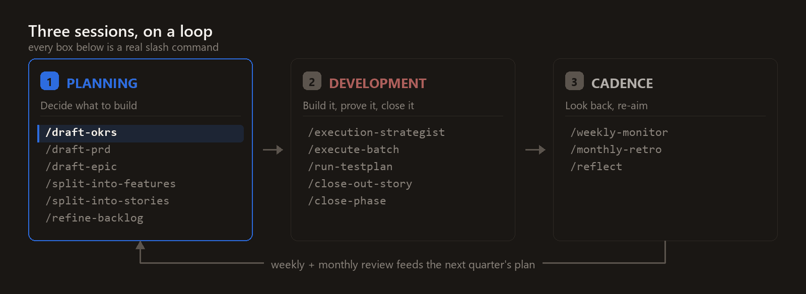
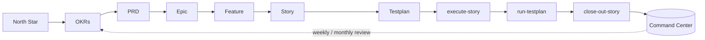

<div align="center">

# Tandem

**The Claude Code project-management plugin.** Tandem replaces the chat you babysit with a governed pipeline — North Star → OKRs → PRD → Epic → Story → tested ship — where every step is a markdown artefact in your repo and every gate is checked rather than assumed. Solo pace, team discipline.

<!-- one line, no trailing spaces: GFM turns line breaks inside a paragraph into <br>, which
     stacks the badges vertically instead of rendering them as a row. -->
[](https://github.com/DATA-AI-XYZ/Tandem/releases) [](LICENSE) [](https://code.claude.com/docs/en/plugins) [](https://github.com/DATA-AI-XYZ/Tandem/stargazers) [](https://www.claudepluginhub.com/plugins/data-ai-xyz-tandem?ref=badge)

[**▶ Live demo — the Tandem Command Center**](https://data-ai-xyz.github.io/Tandem/) · [**Guide**](https://data-ai-xyz.github.io/Tandem/guide.html) · [**Playbook**](https://data-ai-xyz.github.io/Tandem/playbook.html)

</div>

---

Tandem is a Claude Code plugin that takes you from idea to production — without the chaos. You drive the whole plan with slash commands; Tandem makes sure nothing slips: no stories go in-progress without a testplan, no work ships without passing its gates, no decision disappears into the chat log. The result is a team-quality delivery rhythm, at solo-founder pace.

---

## Why this exists

Building with Claude Code, the thing I kept losing wasn't the code — it was the reasoning. A plan gets settled in a long, genuinely good conversation: scope, trade-offs, what's explicitly out. Two days later the only record is a scrollback nobody will read again, me included. The decision that actually mattered — *we're not doing multi-tenant yet, and here's why* — is somewhere around message forty, unlabelled and unsearchable. The next session starts from a worse position than the last one ended.

The second problem is structural. On a team, someone stops half-finished work from being called done: a PM who returns a story with no acceptance criteria, a QA engineer who asks which test proves it. Solo, or in a team of three, nobody holds that line — not because you don't know better, but because you're also the person who wants to ship, and there's no one in the room to say no. AI sharpens this rather than softening it. Ask whether the work is complete and you will usually be told it is.

So Tandem is the missing PM and QA function, written as files and gates instead of people. Plans, decisions and test evidence live in the repo as markdown, versioned next to the code they describe. The gates are mechanical, not advisory: a Story cannot enter *in-progress* without a paired Testplan, and cannot reach *done* without clearing its Definition of Done. "It's basically finished" stops being something either of us can say.

---

## How it works

Tandem installs a `_00-Project-Management/` scaffold into your project and registers a set of `/tandem:*` skills that cover the full North Star → Done lifecycle. Three hooks keep everything honest: a linter that runs on every PM file edit, a prompt hook that applies your chosen conversation Mode, and a generator that rebuilds an interactive HTML **Command Center** whenever your plan changes. All hooks run a single stdlib-only Node entrypoint (`node ${CLAUDE_PLUGIN_ROOT}/_00-Project-Management/93-Scripts/hook.js`) directly — no `npm` step is involved.

It's **stack-agnostic** — the bootstrap asks what you're building (web, mobile, CLI, library, backend, data-pipeline, Power Platform, or automation) and tailors the guidance to match.

**New in 2.7:** Tandem can now run your whole plan **hands-free** — `/tandem:autopilot` drives every phase and batch unattended, checkpoints as it goes, halts on any failure, pauses itself near your Claude usage limit and resumes when the window resets. And every execution now records what it actually cost: stories carry usage estimates, actuals reconcile against them, and the board answers "can I afford to run this batch now?" before you start.

### Why it's different from "AI project management"

Most "AI project management" is a chat log. Tandem is a contract:

- **Closed-set status enum** — exactly nine statuses, never invented ad-hoc, so every board reads the same.
- **Story ↔ Testplan pairing (enforced)** — you cannot create a Story without a paired Testplan where every acceptance criterion maps to a runnable test case. No "trust me, it works."
- **DoR / DoD gates** — work can't enter *in-progress* without meeting Definition of Ready, and can't reach *done* without Definition of Done. The gates are checked, not assumed.
- **ADR-on-the-spot** — every non-obvious decision becomes an Architecture Decision Record in the same edit, so the *why* is never lost.
- **Auto bug-raising** — the moment a test case fails, a structured BUG file is filed before the failure is even reported back to you.
- **A living Command Center** — a single self-contained HTML view of your entire plan, regenerated automatically. (That's the [live demo](https://data-ai-xyz.github.io/Tandem/) above.)

## The lifecycle — three sessions in a loop



The work splits into three kinds of session, and the third one feeds the first:

- **Planning — decide what to build.** `draft-okrs` · `draft-prd` · `draft-epic` · `split-into-features` · `split-into-stories` · `refine-backlog`
- **Development — build it, prove it, close it.** `execution-strategist` · `execute-batch` · `run-testplan` · `close-out-story` · `close-phase`
- **Cadence — look back and re-aim.** `weekly-monitor` · `monthly-retro` · `reflect` — and the review output is the input to the next `draft-okrs`.

The split is enforceable, not just conceptual: `/tandem:mode` sets a persistent conversation Mode (Plan · Dev · Dual · Neutral) that survives across turns, so a planning session doesn't quietly drift into writing code.

<details>
<summary><strong>The full command chain, artefact by artefact</strong></summary>



Every arrow is a slash command. Every box is a markdown artefact in your repo.

</details>

## What people actually use it for

Five concrete jobs. Every command named below exists today — none of this is roadmap.

**Taking a vague idea to a shipped, tested slice.** The main chain: `/tandem:draft-epic` frames the outcome, `/tandem:split-into-features` and `/tandem:split-into-stories` decompose it into stories with paired testplans, `/tandem:refine-backlog` runs the Definition of Ready gate, and `/tandem:close-out-story` runs the Definition of Done — AI code review included — before anything is marked done. Stop at any link you like; the artefacts are useful on their own.

**Clearing a phase without sitting over it.** `/tandem:autopilot` takes a phase and runs it — batch after batch, story after story — checkpointing as it goes, halting on the first gate failure instead of pushing past it, and pausing itself as it approaches your Claude usage limit so it can resume when the window resets.

**Keeping the reason, not just the change.** Non-obvious decisions become Architecture Decision Records in the same edit that makes them, so the *why* lands in the repo rather than the scrollback. Later, `git log` tells you what changed and the ADR tells you what you were thinking.

**Picking up work you've forgotten.** `/tandem:session-start` reads your in-progress and blocked stories, the recent ADRs and the monitor board's revision history, then says where you are and what the next step is. It's the difference between opening a project cold and opening it briefed.

**Cutting an overloaded toolkit down to what this repo needs.** `/tandem:curate-toolkit` ranks everything you have installed by fit for this project — see [below](#ranking-the-tools-youve-installed).

## Install

```bash
# 1. Add the Tandem marketplace
/plugin marketplace add DATA-AI-XYZ/Tandem

# 2. Install the plugin
/plugin install tandem@data-ai-xyz

# 3. Bootstrap it into your project (drops _00-Project-Management/, wires hooks, seeds CLAUDE.md)
/tandem:session-start
```

On install Tandem will:

1. Drop the `_00-Project-Management/` scaffold into your project root (if absent).
2. Register the `/tandem:*` skills covering the full North Star → Done lifecycle.
3. Enable three hooks — lint-on-edit, conversation-Mode-on-prompt, and Command-Center-regen-on-stop.
4. Insert a slim PM rules block into your root `CLAUDE.md` (idempotent, under a managed marker).

> No plugin access? Tandem also ships a paste-prompt installer — see [`BOOTSTRAP-PROMPT.md`](BOOTSTRAP-PROMPT.md).

## Updating

> **One-time step for 2.7.1:** this release renames the plugin's machine identity to kebab-case (`tandem@data-ai-xyz`) so the claude.ai / Cowork marketplace sync accepts it (the skill prefix changes from `Tandem` to `tandem` with it). An install made under the old capitalized name won't update in place — remove it, then re-add the marketplace and run `/plugin install tandem@data-ai-xyz`. Your project's PM files are untouched.

Two layers keep you current — the **plugin** and your project's **kit files**:

1. **Update the plugin** — two commands, no interactive session needed:
   ```bash
   claude plugin marketplace update data-ai-xyz   # refresh the marketplace
   claude plugin update tandem@data-ai-xyz        # pull the new version
   ```
   `claude plugin list` should then show the new version. (Prefer the UI? `/plugin` in any session does the same thing.)
2. **Refresh your project**: inside each project that uses Tandem, run `npm run pm:update` — it non-destructively refreshes the kit's scripts/templates to the plugin's version and never touches your stories, decisions, or board.
3. **Restart your session**: after updating the plugin, restart Claude Code — until you do, hook errors mentioning the old version's cache path are expected and harmless.

## Slash commands

| Command | Hat | When to use |
|---|---|---|
| `/tandem:session-start` | any | Orient at the start of a session: read active work, recent ADRs, the board; announce the next step |
| `/tandem:install` | — | Wire the kit into a project: materialize the PM tree, wire scripts + hooks, generate the dashboard |
| `/tandem:update` | — | Pull kit improvements non-destructively — kit-owned files only, never your work |
| `/tandem:mode` | any | Set or clear the persistent conversation Mode (Plan · Dev · Dual · Neutral) |
| `/tandem:draft-okrs` | Founder | Draft quarterly OKRs from a North Star |
| `/tandem:draft-prd` | Founder→PM | Draft a PRD from an OKR or raw notes |
| `/tandem:draft-epic` | PM | Draft an Epic from an OKR key result or PRD section |
| `/tandem:split-into-features` | PM | Decompose an Epic into Features |
| `/tandem:split-into-stories` | PM | Decompose a Feature into Stories + paired Testplans |
| `/tandem:refine-backlog` | PM | DoR gate — promote to *ready* or list the gaps; never silently promotes |
| `/tandem:critique` | PM | Advisory quality review of a planning artefact — read-only, never rewrites |
| `/tandem:start-phase` | PM | Open a phase: gate the entry state and cut a `phase/<id>` branch |
| `/tandem:execution-strategist` | PM | Plan how to execute an Epic — group stories into batches with lanes & sub-agents |
| `/tandem:execute-story` | Dev | Pull a *ready* Story into active work |
| `/tandem:execute-batch` | Dev | Run a whole strategy "batch" of stories end-to-end |
| `/tandem:execute-batch-parallel` | Dev | Run a file-disjoint batch concurrently — one sub-agent per story, single-writer reconciliation |
| `/tandem:autopilot` | PM | **New in 2.7** — run the whole plan unattended: phase → batches → close, with checkpoint/resume, a usage governor that pauses near your Claude limit and resumes on reset, and quality-first model tiering |
| `/tandem:run-testplan` | QA | Run every test case; auto-file BUGs on failure |
| `/tandem:close-out-story` | QA→PM | DoD gate (incl. AI-code review) + board update |
| `/tandem:close-phase` | PM | Close a phase: gate on all stories done, compile the retro, gated merge to `main` |
| `/tandem:peer-review` | QA | On-demand code review of a diff, branch, PR, or file — blocker/major/minor findings |
| `/tandem:weekly-monitor` | PM | Friday weekly summary; flag stalls and blocks |
| `/tandem:monthly-retro` | Founder/PM | Monthly retrospective |
| `/tandem:document` | Tech Writer | Author the documentation set (overview, getting started, architecture, decisions, features) from your own board |
| `/tandem:curate-toolkit` | PM | Rank installed AI tools by fit for this project's type; write relevance overlays |
| `/tandem:fill-claude-md` | any | Author/refresh `CLAUDE.md` files across the codebase |
| `/tandem:reflect` | any | End-of-session reflection: propose improvements (you approve before applying) |
| `/tandem:core` | — | Force-load the core PM rules (usually auto-loaded) |

Skills are model-invoked — Claude auto-loads them when your task matches — but explicit invocation always works. Two further skills never appear in your command list by design: `write-outcomes` (internal, dispatched by the producer skills) and `path-scope-example` (a copy-me reference for path-scoped skills).

## The Command Center

The headline feature. A single self-contained HTML file, regenerated from your markdown plan, with tabs for the plan tree, the monitor board, the execution strategy, and a glossary. It's built to be glanceable and stays current automatically (the Stop hook regenerates it whenever a PM file changes).

**[▶ Open the live demo](https://data-ai-xyz.github.io/Tandem/)** — generated from a fabricated sample project (not real data), so it's safe to share and explore.

<!-- Screenshots live under docs/ once generated:


-->

## Ranking the tools you've installed

The marketplaces have got noisy. A working Claude Code setup can carry dozens of Skills, Agents, Commands and Plugins, most of them irrelevant to the project actually in front of you — and every one is a candidate the model has to weigh before it does anything.

`/tandem:curate-toolkit` audits the lot. It enumerates every installed **Skill, Agent, Command and Plugin**, then ranks each one **HIGH / MED / LOW** for fit against this project's type and stack, with a one-line rationale per item — *"LOW — data-pipeline project; this React skill is off-stack"*. Anything referenced somewhere in the project but not actually installed is reported as a gap rather than passed over in silence.

The ranking is written as a relevance overlay under `_00-Project-Management/97-AI-Reference/`, so it's a file you can read, diff and correct — not advice that scrolls away. Re-run it when the stack changes or after you install something new.

## What's inside

```
Tandem/
├── .claude-plugin/
│   ├── plugin.json            Manifest (name: tandem)
│   └── marketplace.json       data-ai-xyz marketplace listing
├── skills/                    The /tandem:* skills (full lifecycle)
├── hooks/                     PostToolUse (lint) + UserPromptSubmit (Mode) + Stop (Command-Center regen)
├── docs/                      Live-demo Command Center (GitHub Pages)
├── BOOTSTRAP-PROMPT.md        Paste-prompt installer (no-plugin path)
├── CONTRIBUTING.md · SECURITY.md · CHANGELOG.md · LICENSE
└── README.md
```

## Project types supported

`web-app` · `mobile` · `cli` · `library` · `backend-service` · `data-pipeline` · `power-platform` · `automation` — the bootstrap injects the matching gotchas and per-type guidance.

## Documentation

The full set is published alongside the demo — every page is a sibling of the board:

| Page | What it covers |
|---|---|
| [Guide](https://data-ai-xyz.github.io/Tandem/guide.html) | End to end: install → bootstrap → strategy → decompose → execute → close. Start here. |
| [Playbook](https://data-ai-xyz.github.io/Tandem/playbook.html) | Situation-to-command recipes, the hats, the gates, and what to do when one fails. |
| [Overview](https://data-ai-xyz.github.io/Tandem/overview.html) | What Tandem is, who it's for, and the core rules. |
| [Getting started](https://data-ai-xyz.github.io/Tandem/getting-started.html) | Prerequisites, install, first run, troubleshooting. |
| [Command lifecycle](https://data-ai-xyz.github.io/Tandem/command-lifecycle.html) | The canonical command chain, in order. |
| [Features](https://data-ai-xyz.github.io/Tandem/features.html) | Every skill and script, and what each one does. |
| [What each thing is for](https://data-ai-xyz.github.io/Tandem/what-each-thing-is-for.html) | Per-artefact reference: epics, features, stories, testplans, bugs, ADRs. |
| [Architecture](https://data-ai-xyz.github.io/Tandem/architecture.html) | How folders, skills, hooks and scripts fit together. |
| [Decisions](https://data-ai-xyz.github.io/Tandem/decisions.html) | The ADR digest — why the kit is built this way. |
| [Context economics](https://data-ai-xyz.github.io/Tandem/context-economics.html) | Why the kit is frugal with context, and how that shapes the design. |
| [HTML output convention](https://data-ai-xyz.github.io/Tandem/html-output-convention.html) | When the kit emits HTML artefacts and where they live. |

Every page is also reachable from the **Tandem** tab of the [live demo](https://data-ai-xyz.github.io/Tandem/#group=tandem).

## Contributing & security

- [`CONTRIBUTING.md`](CONTRIBUTING.md) — how to propose changes.
- [`SECURITY.md`](SECURITY.md) — responsible disclosure.

## License

[MIT](LICENSE) — provided **"as is"**, without warranty of any kind (see [LICENSE](LICENSE) and [NOTICE.md](NOTICE.md)).

## Disclaimer

"Claude" and "Claude Code" are trademarks of Anthropic, PBC. Tandem is an independent project and is **not affiliated with, endorsed by, or sponsored by Anthropic**. Tandem runs locally; its scripts and hooks make **no network calls** and collect **no telemetry**. It creates and edits files under your project's `_00-Project-Management/` tree — review what it does and use it at your own risk. See [NOTICE.md](NOTICE.md) for full details.

## Contact

- Web: <https://www.dataxyzconnect.com>
- Email: tandem@dataxyzconnect.com · Maintained by DATAXYZ CONNECT
