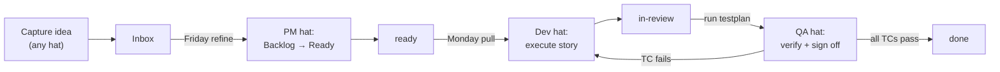

# Day-to-Day Workflow

How you actually use this kit, with a worked example. Read this once after deployment. Re-read whenever you forget the rhythm.

---

## 1. The 60-second mental model

```
Requirement → INBOX → BACKLOG → READY → ACTIVE → REVIEW → DONE
                 ①        ②        ③       ④        ⑤       ⑥
```

You don't memorise stages. You memorise **which prompt to use when**. There are 10 prompts in `92-Prompts/`. You'll use 4 of them 80% of the time.

---

## 2. The four prompts you live in

| # | Prompt | When | How often |
|---|---|---|---|
| **05** | `refine-backlog-to-ready.md` | Friday | Weekly |
| **06** | `execute-story.md` | Start of work session | Daily |
| **07** | `run-testplan.md` | After code is done | Daily |
| **08** | `close-out-story.md` | After tests pass | Daily |

The other 6 are scaffolding (Epic drafting, OKR refresh, monthly retro) — used less often.

---

## 3. Worked example — "add a wishlist feature"

The whole lifecycle on one new requirement, end to end.

### Step 1 · Capture (30 seconds)

You're in the middle of something else. An idea hits.

Open Claude Code. Type:

> Capture this in the Inbox: customers can save items to a wishlist.

Claude creates `10-Inbox/INBOX-NNNN-customer-wishlist.md` with `status: not-started`. Done. You go back to what you were doing.

### Step 2 · Friday refinement (PM hat, 30 min weekly)

Friday afternoon. You open Claude and paste **prompt 05** (`refine-backlog-to-ready.md`).

Claude:
- Lists 5 unrefined items in Inbox/Backlog
- For each, asks you: *"What OKR does this serve? What are the acceptance criteria?"*
- If the wishlist item gets approved, Claude promotes it:
  - Writes a new **Epic** (or links to an existing one)
  - Drafts **Features** under it (prompt 03)
  - Drafts **Stories** with paired **Testplans** (prompt 04)
- Each new artefact starts at `status: not-started`. Each must pass the DoR checklist before it can flip to `ready`.

Now `WishlistEpic` lives in `30-Epics/`, decomposed into 3–5 stories in `32-Stories/`, each with a Claude-runnable testplan in `33-Testplans/`.

### Step 3 · Monday: pull one to work (Dev hat, daily)

Monday 9 am. Open Claude. Type:

> What's ready to pull?

Claude reads `42-Monitor/DASHBOARD.html`, lists Ready stories. You pick one — say `STORY-12.3.04-wishlist-add-button`.

Paste **prompt 06** (`execute-story.md`) with the story path.

Claude:
- Verifies DoR is met (if not, stops and asks)
- Flips `status: in-progress`, sets `started_at` to now
- Reads the story, the paired testplan, and your `PROJECT-CONTEXT.md`
- Starts coding — reads existing patterns from your codebase, writes the component, wires it up
- If it hits a real decision (*"Where do we store wishlist items — Firestore subcollection or separate collection?"*), Claude **STOPS**, creates `40-Decisions/ADR-NNNN-wishlist-storage.md`, picks an option with rationale, then continues
- Marks AC checkboxes as it completes them

After 2–3 hours: code done. Claude flips story to `in-review`.

### Step 4 · Verify (QA hat, 15 min)

Same day or next morning. Paste **prompt 07** (`run-testplan.md`) with the testplan path.

Claude:
- Runs every TC's `Command:` against your actual code
- Updates each TC's `Result:` line with PASS or FAIL
- If any TC FAILs → automatically files `34-Bugs/.../BUG-YYYYMMDD-NN-*.md` with reproduction steps, suspected root cause, fix direction
- If all TCs PASS → reports green, recommends prompt 08

### Step 5 · Close out (5 min)

Paste **prompt 08** (`close-out-story.md`).

Claude:
- Runs the full DoD checklist (lint, tests, build, ADR present, MONITOR updated, dashboard regenerated)
- If anything fails → stops and asks
- If all pass → flips `status: done`, sets `completed_at`, updates `42-Monitor/MONITOR.md` with a one-line revision-history entry, runs `npm run pm:dash` to refresh the dashboard

Refresh `DASHBOARD.html` in your browser. The wishlist story is now green, metrics tick up.

### Step 6 · Friday again

Paste **prompt 09** (`weekly-monitor-update.md`). Claude summarises the week, updates MONITOR with revision history, regenerates dashboard, flags any stalled stories.

---

## 4. A realistic week

| Day | Time | What you do |
|---|---|---|
| Mon 9:00 | 10 min | Open dashboard. Paste prompt 06 with a Ready story. Start work. |
| Mon 12:00 | 5 min | Story done? Paste prompt 07 (test). Then prompt 08 (close-out). |
| Mon 13:00 | 10 min | Paste prompt 06 with next story. |
| Tue–Thu | varies | Same pattern. Capture random ideas to Inbox with one-liner "Capture this: …" |
| Fri 16:00 | 30 min | Paste prompt 05 (refine 5 backlog items). Paste prompt 09 (weekly summary). |
| 1st Mon of month | 60 min | Paste prompt 10 (monthly retro). Review the month. Set one change for next month. |
| Quarterly | 2 hours | Paste prompt 01 (draft OKRs from North Star). Review strategy. |

**Total process overhead: ~2 hours/week.** Everything else is actual building.

---

## 5. Where you "live" day-to-day

You spend almost all your time in **two places**:

1. **Claude Code session** — where you paste prompts and Claude does the work
2. **`DASHBOARD.html` open in a browser tab** — the live view of where everything stands

You almost never open a markdown file directly. Claude reads and writes them; the dashboard renders them. The markdown is the *storage*; the dashboard is the *interface*.

### Launch where you'll do the work

**Rule:** when a story's `files_touched:` all cluster under one path (e.g. `apps/api/`), launch Claude *in that subdirectory*, not at repo root. A subdir session loads only that directory's `CLAUDE.md` (created from `91-Templates/SUBDIR-CLAUDE.template.md`) plus the lean root — so test/lint scope, conventions, and the right `@-mention` targets are local instead of buried in the central `PROJECT-CONTEXT.md` table. Smaller context, scoped tests, less `@-mention` friction. This is the rule Peter has been applying by feel; encode it.

**Exceptions — launch at repo root when the work genuinely spans the tree:**
- **Cross-cutting refactors** — rename/move a symbol used across services, change a shared interface, sweep a deprecated API.
- **Dependency updates** — bump a package and fix every call site; lockfile + multi-service config changes.
- **Codebase-map-spanning work** — anything that needs the whole `93-Scripts/.../CODEBASE-MAP` view, multi-service wiring, or edits in 3+ unrelated directories at once.

When you can't tell, ask: *"do the files I'll touch live under one path?"* If yes → subdir. If they're scattered or you don't know yet → root. The full root-vs-subdir trade-off (context size, test scoping, MCP/skill availability, `@-mention` friction, CLAUDE.md load order) is tabulated in `CLAUDE-CODE-CONFIG.md` §2.1.5; the single-app-vs-monorepo split that decides whether subdir `CLAUDE.md` files exist at all is §2.1.2 + ADR-0009.

---

## 6. Sizing a new requirement

When something new comes in, decide its size. This determines which prompt to use.

| Size | Goes where | Process | Prompt |
|---|---|---|---|
| One-line idea | Inbox | One sentence to Claude: "Capture: …" | (no prompt — just ask) |
| 1–2 hour fix | Backlog → straight to Ready | Promote in next Friday refinement | 05 |
| 1–2 day feature | New Story under existing Feature | Drafts story + testplan | 04 |
| 1–2 week feature | New Feature (or several Stories) under existing Epic | Drafts feature, then its stories | 03 then 04 |
| Strategic bet | New Epic | Drafts epic, then features, then stories | 02 then 03 then 04 |

### Don't know the size? Ask Claude.

> I want customers to be able to save items. Where does this fit — Story, Feature, or Epic? Propose the breakdown.

Claude reads your existing Epics, OKRs, and relevant code, then proposes the right level. You approve or refine. That's the entire planning ceremony.

### Rhythm note — explore before you narrow

**Before drafting an Epic with ≥3 candidate approaches, generate the exploration HTML first.** Copy `91-Templates/EXPLORATION.template.html` to `41-Reports/EXPLORATION-YYYY-MM-DD-<slug>.html`, fill the option slots, compare them side by side, then radio-select the winner and use its "Export → ADR" button to seed the ADR's "Alternatives considered" block. This stops you from committing to one approach in the same pass that you draft the Epic. See prompt 02 step 5.

---

## 7. The first session after deployment

Your very first time using the kit on a fresh project:

1. **Open the dashboard** — `42-Monitor/DASHBOARD.html` in a browser. It'll show "0 artefacts". Correct.
2. **Write the North Star** — open `00-Strategy/NORTH-STAR.md` (or use prompt 01 to draft it). One page.
3. **Write the OKRs** — use prompt 01. Three Objectives, 2–3 Key Results each.
4. **Draft the first Epic** — use prompt 02. Pick the highest-impact OKR. Let Claude draft.
5. **Split into Features** — use prompt 03 on that Epic.
6. **Split first Feature into Stories** — use prompt 04. Now you have Stories + paired Testplans.
7. **Refine top story to Ready** — use prompt 05 on just that one.
8. **Pull it to work** — use prompt 06. You're now operating the kit.

From step 1 to step 7: ~3 hours. From step 8 onwards: this is just your work.

---

## 8. What if a prompt doesn't fit?

The 10 prompts cover ~95% of moves. The other 5%:

- **Spike / exploration** — no formal artefact yet, just research. Use a `BACKLOG-NNNN-spike-*.md` to capture the question + findings. Promote to a Story only when the spike answers something concrete.
- **Hotfix in production** — bypass the lifecycle. Fix the code. AFTER the fix is deployed, retroactively create a BUG file + a STORY-NN.M.PP file describing what was done, with `status: done`. Do not skip the documentation step — future-Claude needs to know what changed and why.
- **Refactor with no user-visible outcome** — file as a BACKLOG entry (`type_of_work: tech-debt`). Promote to a Story when scoped enough to estimate.
- **Documentation-only work** — Story with `type_of_work: docs`. Testplan can be minimal (a TC that greps for the expected content).

---

## 9. Hat protocol — when to announce

At the start of any substantive Claude session, state which hat:

- **Founder hat** — strategic decisions, OKRs, epic approvals, sunset calls
- **PM hat** — refining backlog, drafting epics/features/stories, MONITOR updates
- **Dev hat** — executing stories, writing code, making implementation decisions (ADRs)
- **QA hat** — running testplans, filing bugs, signing off DoD

Why announce: it tells Claude which mode to optimise for. PM hat asks "is this scoped?". Dev hat asks "is this efficient?". Mixing is the most common cause of scope drift solo.

The loop, with the hat that owns each move (markdown → Mermaid per ADR-0005; see `91-Templates/DIAGRAM-CHEATSHEET.md`):



---

## 10. Anti-patterns to avoid

- **Pulling work that isn't Ready.** If a story hasn't passed DoR, paste prompt 05 first. Don't skip.
- **Closing a story without DoD.** "Tests are flaky so I'll skip them" → file a BUG instead, leave the story `in-review`.
- **Skipping ADRs.** Three months from now you won't remember why you picked option A. Future-Claude won't either.
- **Letting MONITOR drift.** If the dashboard hasn't been regenerated in a week, you've lost the operating signal. Run `npm run pm:all` every Friday minimum.
- **Hoarding Inbox items.** If something has been in `not-started` for 90 days, archive it. Sunset rule (SOP §15).
- **Re-deriving conventions in chat.** If you find yourself explaining the same thing to Claude twice, it belongs in `PROJECT-CONTEXT.md`.
- **Running the full test suite on a one-file change.** If the story only touches one service, run the tests scoped to that service (e.g. `npm test -- --testPathPattern=wishlist` not bare `npm test`). The DoD checklist requires "tests green," but green means the tests that exercise the changed code — not every test in the repo. Scoped test commands belong in `PROJECT-CONTEXT.md` per area. Bare `npm test` on every story burns minutes that compound into hours weekly. See `CLAUDE-CODE-CONFIG.md` §4 anti-patterns.
- **Pasting grep results into the main thread.** If you find yourself running `grep -r` for anything bigger than "where is this exact symbol in this exact file," spawn an Explore agent (`Agent({ subagent_type: "Explore", ... })`). Lookups don't belong in main-thread context. See SOP §18 subagent policy.
- **Launching Claude in a subdirectory without local context.** Launching Claude in a subdirectory? Make sure that subdirectory has its own `CLAUDE.md` so test/lint commands are local — otherwise the session loads the whole central `PROJECT-CONTEXT.md` table to learn one service's commands. Use `91-Templates/SUBDIR-CLAUDE.template.md` in monorepos. See `CLAUDE-CODE-CONFIG.md` §2.1.2 + ADR-0009.

---

## 11. When in doubt, ask Claude

Specific phrases that work well:

| You type | Claude does |
|---|---|
| "What's ready to pull?" | Lists Ready stories from the dashboard |
| "What's blocked and why?" | Lists `blocked` items with reasons |
| "What did we ship this week?" | Reads MONITOR revision history |
| "Where does X fit?" | Proposes Story/Feature/Epic level for a new idea |
| "Is the dashboard fresh?" | Compares MONITOR last-update to file timestamps; regens if stale |
| "Sunset stale work" | Finds 90+ day `not-started` items, proposes `wontfix` or `archived` |

---

## 12. The single sentence summary

**Capture → Refine on Friday → Pull on Monday → Execute → Verify → Close → Repeat.**

Everything else in this kit exists to make that loop reliable.
