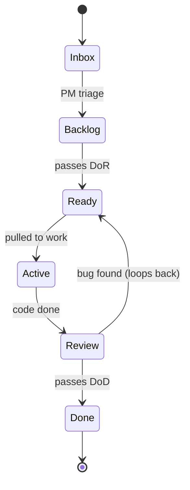

# Standard Operating Procedure

The single source of truth for how this project is run. Open this when in doubt.

---

## 1. Roles — one operator, four hats

| Hat | Owns | Asks | Cadence |
|---|---|---|---|
| **Founder** | `00-Strategy/`, OKRs, epic approvals, sunset decisions | "What business outcome does this move?" | Quarterly 2-hour session |
| **PM** | Inbox → Backlog → Ready refinement, MONITOR updates | "Is this Ready? Does it pass DoR?" | Weekly 30-min review |
| **Dev** | Code, tests, story status Ready → Active → Review | "Did I make a decision? Time for an ADR." | Daily 10-min check-in + work blocks |
| **QA** | Testplan execution, bug raising, DoD sign-off | "Does every TC pass? Any AC un-verified?" | Whenever a story flips to in-review |

Announce the hat at session start. Never mix hats in a single session.

---

## 2. Lifecycle



Stories never move folders. Only the `status:` field changes.

**Serial vs parallel execution.** A chat's stories run **serially** by default (`execute-batch`):
**serial is mandated** whenever the batch is not *provably file-disjoint*. Stories may run in
**parallel** (`execute-batch-parallel`, one sub-agent per story) **only when** the batch passes the
disjoint-`files_touched` precondition (`pm:batch-check`, ADR-0075) **and** every story is DoR-`ready`
— any `CONFLICT` or `UNKNOWN` verdict falls back to serial. Parallel fan-out never relaxes the gate
contract; see §5 for how it interacts with the WIP cap (ADR-0077).

| Stage | Status value | Gate to advance |
|---|---|---|
| Inbox | `not-started` | PM 5-min triage |
| Backlog | `not-started` | PM refinement (partial DoR) |
| Ready | `ready` | Full DoR checklist passes |
| Active | `in-progress` | Paired TESTPLAN exists |
| Review | `in-review` | All ACs implemented, self-review done |
| Done | `done` | Full DoD checklist passes |

### 2.1 Founder-action inbox items — answer → update → close → archive (ADR-0063)

Founder-action items are **not** stories (the "stories never move folders" rule does not apply to
them). They are ephemeral founder-decision records that live in `10-Inbox/` and surface in the
Now-page **Pending action** widget. Create one from `91-Templates/INBOX-ACTION.template.md`
(`type: inbox-action`; a clear **Question**, **Why this matters**, **Recommendation**, and an empty
**Answer**). They follow a three-state lifecycle — perform it consistently, as **one atomic step**
when archiving:

1. **open** (`needs_action: true`, `action_status: open`) — surfaces in the widget (Question as the
   title, Recommendation surfaced).
2. **answered** — write the founder's decision into the **Answer** section; set `answered_at`.
3. **archived** — in the **same step**: flip `needs_action: false`, `action_status: archived`, and
   **move the file to `10-Inbox/archive/`**. The generator excludes `10-Inbox/archive/` from the
   live scan, so archived items drop off the Pending-action widget **and** the Capture tab while
   remaining readable on disk as a durable founder-decision trail.

The move-and-flip must be atomic, or the widget and the audit trail diverge. See **ADR-0063** for
the rationale (why move, not just flag) and the alternatives considered.

---

## 3. Status enum — closed set, exactly nine values

| Value | Meaning | When set |
|---|---|---|
| `not-started` | Captured, not yet refined | On create |
| `ready` | Passes DoR; pullable into Active | Manually after DoR pass |
| `in-progress` | Actively being worked | On first commit / first test write |
| `in-review` | Code done, awaiting QA | On PR open / self-review |
| `done` | Passes DoD | On completion |
| `blocked` | External dependency; not pullable | Manually, with reason |
| `wontfix` | Decided not to do (bugs/backlog only) | With ADR link |
| `duplicate` | Tracked elsewhere | With link to dupe |
| `archived` | Old/obsolete, kept for history | Manually |

Never invent values. Never use `open / shipped / completed / fixed / deferred / Planned`.

---

## 4. Cadence

| Rhythm | Time | When | What |
|---|---|---|---|
| Daily | 10 min | Start of work | Open MONITOR. Pick one Ready story. Flip to in-progress. Work. |
| Weekly | 30 min | Friday | PM hat: prune Inbox → Backlog; refine top 5 Backlog → Ready; flip done stories; update MONITOR. |
| Monthly | 60 min | 1st Monday | Retro: write RETRO-YYYY-MM.md. What worked / What hurt / One change. |
| Quarterly | 2 hours | Quarter start | Founder hat: review OKRs; archive obsolete epics; write next quarter's OKRs. |
| Quarterly | 1 hour | Quarter start | Config-review hat: audit CLAUDE.md + skills + hooks for stale instructions written to compensate for older model limitations. Log in `14-Retros/RETRO-YYYY-Qx-config.md`. See `90-Standards/CLAUDE-CODE-CONFIG.md` §3 for the scan checklist. |

---

## 5. WIP limits (Kanban discipline)

- `in-progress`: max **2** stories
- `in-review`: max **3** stories
- `blocked`: max **5** stories

Hitting a limit is a signal — close before opening. If `blocked` hits 5, escalate to Founder hat: are the right dependencies even being picked?

**Batch-parallel and the WIP cap (ADR-0077).** `execute-batch-parallel` **preserves** the `in-progress`
cap of 2 — it does **not** raise it. Fan-out consumes no WIP slots (sub-agents work in isolation and
never flip board status; stories stay `ready` until the serialised reconciliation flips them one at a
time, so live `in-progress` ≤ 1). The cap is honoured even on failures: at most 2 failed stories may
be left `in-progress`; any excess failures are set `blocked`. When parallel execution is allowed vs
when serial is mandated is defined in §2; how wide a batch may fan out is bounded by batch size
(ADR-0026), not the WIP cap.

---

## 6. Definition of Ready (DoR)

A story is Ready when ALL of:

- [ ] Linked to a Feature, which links to an Epic, which has `okr:` or `prd_section:`
- [ ] Acceptance criteria written as testable checkboxes (machine can verify)
- [ ] Paired TESTPLAN file exists at mirrored path
- [ ] Every AC maps to ≥ 1 TC in the TESTPLAN
- [ ] Every TC has a `Command:` Claude can run unattended (no manual steps)
- [ ] Dependencies listed and either done or scheduled
- [ ] Estimate set (XS / S / M / L / XL)
- [ ] `type_of_work:` set to a concrete discipline (not the template placeholder) — fuels `execution-strategist` / `execute-story` sub-agent assignment (FEAT-03.1, SOP §11.3)
- [ ] Risks section non-empty ("none — reviewed YYYY-MM-DD" is acceptable)
- [ ] Premise verified — any claim the item makes about another named artefact's state (status / existence / supersession), or intent to retire/archive/delete/supersede/mutate it, is checked against that artefact's current frontmatter; a stale or contradicted claim is a DoR gap (enforced by `refine-backlog`; flagged by `critique`)

---

## 7. Definition of Done (DoD)

A story is Done when ALL of:

- [ ] All AC checkboxes ticked
- [ ] All TCs in paired TESTPLAN executed; Result = PASS (or FAIL with linked BUG)
- [ ] Project-specific quality gates pass (see `PROJECT-CONTEXT.md`):
  - [ ] Lint clean (e.g. `npm run lint`)
  - [ ] Tests green (e.g. `npm test`)
  - [ ] Build clean (e.g. `npm run build`)
- [ ] No new runtime errors on smoke
- [ ] If UI: visual contract tests green (per `PROJECT-CONTEXT.md`)
- [ ] **AI-code review pass** — if Claude authored more than a trivial diff (rule of thumb: >50 net lines changed across >2 files), run a separate critical-review pass before merging. Use the `code-reviewer` agent or paste the diff into a fresh session with the explicit prompt: "Review this diff for bugs, security issues, and divergence from PROJECT-CONTEXT.md conventions. Flag anything before merge." Capture findings in the **AI-CODE-REVIEW HTML artefact** (see §7.1), record its path in the story's `ai_review_artefact:` frontmatter, and flip `ai_review:` to `completed-YYYY-MM-DD`. Skip for trivial changes (typo fixes, copy edits, one-line config tweaks) — set `ai_review: skipped-trivial` (with `ai_review_skip_reason`) or `n-a`; no artefact required for those.
- [ ] Frontmatter updated atomically: `status: done`, `completed_at: <now>`
- [ ] `42-Monitor/MONITOR.md` updated (bar + count + one-line revision history)
- [ ] `42-Monitor/DASHBOARD.html` regenerated (`npm run pm:dash`)
- [ ] ADR created for any non-obvious decision
- [ ] BACKLOG entry created for any new tech debt

### 7.1 AI-code-review severity rubric

The AI-code-review pass (DoD item above) records each finding in an **AI-CODE-REVIEW HTML artefact** — copy `91-Templates/AI-CODE-REVIEW.template.html` to `41-Reports/AI-CODE-REVIEW-<story-id>-<YYYY-MM-DD>.html`, interpolate the diff + annotations, and link it from the story's `ai_review_artefact:` field. Each annotation carries `file:line`, a `category` (security / correctness / perf / style / dead-code), a `severity`, the `reasoning`, and a `suggested fix`. Severity is one of **four levels**:

| Severity | Colour | Meaning | Gate |
|---|---|---|---|
| **blocker** | red | Ships a bug, security hole, data-loss path, or breaks a contract. Merging it is wrong. | **Blocks `status: done`** — see rule below. |
| **critical** | orange | Real defect or risky divergence that should be fixed in this PR, but isn't catastrophic. | Fix this PR or file a BUG with explicit acceptance. |
| **warning** | yellow | Smell, missing edge-case handling, or convention drift. Fix or justify. | Reviewer discretion; record the call. |
| **nit** | green | Optional polish — naming, formatting, a clearer comment. | Optional. |

Worked examples per category:

- **security / blocker:** annotation reasoning rendered via `innerHTML` (XSS). **perf / critical:** O(n²) scan added to a hot validator path. **correctness / blocker:** off-by-one that drops the last diff line. **style / nit:** inconsistent quote style. **dead-code / warning:** an exported helper no longer referenced after the refactor.

**Blocker → no `done` flip (hard rule).** If the AI-CODE-REVIEW artefact records **one or more `blocker` findings**, the story MUST NOT advance to `status: done`. Resolve every blocker (re-review, re-generate the artefact) until the blocker count is zero. critical / warning / nit findings do not block the flip but must be triaged (fixed, or recorded as accepted with rationale). The close-out-story skill enforces this gate before flipping status; validator **R15b** enforces that a completed review actually carries an artefact.

---

## 8. Estimation scale

| Size | Duration | Examples |
|---|---|---|
| XS | ≤ 0.5 day | A single function. A config tweak. A copy edit. |
| S | 1–2 days | A small component. A simple endpoint. A single-table migration. |
| M | 3–5 days | A page. A feature flag. A moderate integration. |
| L | 1–2 weeks | A slide-over with state. A new service. Multi-step flow with persistence. |
| XL | > 2 weeks | **Stop. Split it.** XL is a smell, not a size. |

If you estimate XL, do not pull to Ready. Split first.

---

## 9. ADR triggers

Create an ADR when:

- Choosing between two viable libraries / services / patterns
- Picking a schema field name where two were plausible
- Deferring a sub-feature with rationale future-you needs
- Setting a non-obvious threshold (rate limit, timeout, batch size, pagination size)
- Adopting a convention that diverges from defaults

Don't create ADRs for: routine tool choices already standard in the project, obvious one-way doors.

---

## 10. Strategy linkage rule

Every Epic must have `okr:` (preferred) or `prd_section:` in frontmatter.

An Epic without strategic linkage is not an Epic — it's a backlog item dressed up. Reject at PM-hat refinement. Ask: "What business outcome does this move?"

---

## 11. Frontmatter contract

Every artefact's YAML frontmatter must include:

```yaml
---
type:        epic | feature | story | testplan | bug | adr | backlog | release | retro
id:          <TYPE-ID>
title:       <human-readable>
status:      <one of the 9 enum values>
created_at:  'ISO 8601 with offset'
started_at:  ''         # set when status → in-progress
completed_at: ''        # set when status → done / wontfix / duplicate / archived
---
```

Plus relationship and type-specific fields per the templates in `91-Templates/`.

Timestamp format: `YYYY-MM-DDTHH:MM:SS±HH:MM` (e.g. `2026-05-20T14:32:00+01:00`). Always quoted as a string. Source of "now": system clock, not chat-stated date.

**Optional founder-facing `outcome:`** — Story and Feature frontmatter may carry an optional `outcome:` field: one founder-facing sentence describing *what you'll have* once the unit is done — the tangible capability, not the implementation. It is **optional and never required**, but a missing `outcome` on a Story or Feature is nudged by a **non-fatal `pm:lint` warning** (rule **W1** — a warning that is reported but never fails the build; only fatal violations exit 1, see [ADR-0061](../40-Decisions/ADR-0061-non-fatal-lint-warning-tier.md)). The dashboard's Implementation Strategy view surfaces the outcome on chat cards and phase headers (FEAT-14.2), and `execution-strategist` carries it on each `chat`/`phase` in its JSON sidecar.

### 11.1 Output format selection — Markdown vs HTML

Most artefacts in this kit are markdown — short, version-controllable, diff-friendly, render natively on GitHub. Reach for **HTML** when at least one of these triggers fires:

| Trigger | Why HTML wins |
|---|---|
| Artefact length would exceed **>~100 lines** of markdown | Tabs / collapsible sections / sticky nav make a long doc scannable; markdown forces top-to-bottom scrolling |
| Document benefits from **navigation** (jump to section, search, filter) | Browser handles this for free; markdown does not |
| Side-by-side **comparison** of ≥3 options is the primary value | A table is OK; a comparison grid with sticky headers and per-column highlight is much better in HTML |
| **Embedded code samples** that benefit from syntax highlighting + copy buttons + line-numbered anchors | GitHub markdown is fine for short snippets; HTML wins past ~50 lines per snippet |
| **SVG / diagrams** are central to the message (architecture, ERD-light, flow) | HTML lets diagrams sit inline with surrounding prose; markdown only embeds them as images |
| Output is intended for **a non-developer stakeholder** (founder, designer, client) | Stakeholders skim; tabs + tables + visual hierarchy beat raw markdown |

If **none** of those fire, stay in markdown. Defaulting to HTML for short artefacts buys overhead (HTML scaffold, no native git diff) for no benefit.

**Where HTML artefacts live:**

- `42-Monitor/` — dashboards (e.g. `DASHBOARD.html`, generator-owned)
- `41-Reports/` — audits, snapshots, side-by-side comparisons, exploratory HTML
- `20-Requirements/` — long-form PRDs, stakeholder-facing specs
- `90-Standards/` — long-form standards that pair with their markdown (e.g. `DAILY-WORKFLOW.html` mirrors `DAILY-WORKFLOW.md`)

**How an Epic / Feature links to its HTML artefacts:**

Optional `html_artefacts:` array in the frontmatter. Each entry is a repo-relative path to a sibling HTML file. Validator R15 enforces that each listed path exists.

```yaml
html_artefacts:
  - '_00-Project-Management/41-Reports/EXPLORATION-2026-05-22-session-start.html'
  - '_00-Project-Management/20-Requirements/PRD-onboarding-v2.html'
```

**Reference template:** [`91-Templates/HTML-ARTEFACT.template.html`](../91-Templates/HTML-ARTEFACT.template.html) — copy, rename, fill in. Has tabs, table, SVG container, light/dark mode, no external CDN dependencies.

**How a Story / Testplan feeds HTML context to its verification agents:**

Optional `html_context:` array on the STORY and TESTPLAN frontmatter. Each entry is a repo-relative path to a sibling HTML artefact the verification agents must read *before* reviewing or testing the work — so the architectural reasoning captured in explorations, annotated diffs, and options-comparisons is not invisible to the agents that verify it (they read the same context the human reviewer does). The close-out-story skill ingests these paths before its R14 AI-code review; run-testplan ingests them before executing test cases. Validator **R16** enforces that each entry is a repo-relative path (no absolute paths, no `..` traversal) pointing at an existing file — the same path-safety contract as R15.

```yaml
html_context:
  - '_00-Project-Management/41-Reports/EXPLORATION-2026-05-22-session-start.html'
  - '_00-Project-Management/41-Reports/AI-CODE-REVIEW-STORY-01.2.03-2026-05-22.html'
```

**`html_artefacts:` vs `html_context:` — distinct roles:**

- `html_artefacts:` (Epic / Feature, validated by R15) — *outputs* the artefact owns and publishes.
- `html_context:` (Story / Testplan, validated by R16) — *inputs* the verification agents read before reviewing/testing this unit of work.

**Guidance (not validator-enforced):**

- List only **prior** artefacts — never an artefact the current story itself produces. A story referencing its own future HTML creates a read-before-exists loop; the close-out agent would try to read a file that doesn't exist yet.
- Keep listed artefacts small. Only list files **< ~50 KB** or those with a clear summary section — `html_context:` files are read into the agent's context budget at review/test time, and a large HTML file can crowd out the diff under review.

### 11.2 Story planning fields — `depends_on:` and `files_touched:`

Two **optional** fields on STORY frontmatter give `execution-strategist` (FEAT-02.3) the two grouping signals beyond same-FEAT: dependency chain and shared-files affinity. Both are optional — the validator only enforces them when present, so existing stories that omit them stay clean. See ADR-0020.

**`depends_on:`** — STORY ids this story depends on. Each entry is a bare STORY id (`STORY-NN.M.PP`).

```yaml
depends_on:
  - STORY-02.1.01
  - STORY-02.2.03
```

- **Validator R17:** each entry must be a well-formed STORY id (`STORY-NN.M.PP`) that points at an **existing** story file under `32-Stories/`. 
- **Forward references are rejected.** A `depends_on` pointing at a story that has not been created yet is a violation — create the depended-on story first. This keeps `execution-strategist`'s dependency graph honest (it groups *ready* stories; a dangling edge would mis-order a batch) and is cheap to satisfy. Rationale in ADR-0020.

**`files_touched:`** — repo-relative paths this story expects to modify. Fuels `execution-strategist`'s shared-files affinity grouping.

```yaml
files_touched:
  - '_00-Project-Management/93-Scripts/validate-frontmatter.js'
  - 'scaffold/_00-Project-Management/91-Templates/STORY.template.md'
```

- **Validator R18:** each entry must be a repo-relative path — **no absolute paths, no leading `/`, no `..` traversal** (rejected on POSIX and Windows drive-absolute forms alike).

### 11.3 Story sub-agent hint — `suggested_agents:`

**Optional.** Names the sub-agent(s) best suited to implement a story. The planner sets it when a specific specialist clearly fits; `execute-story` and `execution-strategist` resolve the agent for the work. See FEAT-03.1 / ADR-0023.

```yaml
suggested_agents:
  - react-expert
  - security-engineer
```

- **Resolution order:** `suggested_agents` (if present) → the PROJECT-CONTEXT `type_of_work → sub-agent` map → discipline-only / `general-purpose` fallback. An unknown or uninstalled agent never hard-fails; it degrades to the next step.
- **Validator R19:** when present, `suggested_agents` must be a **list of non-empty strings**. **Shape only** — a scalar (e.g. `suggested_agents: react-expert`) is rejected, but agent *existence* is **not** checked: the installed roster is project-specific. Omit the field (or leave it empty) when `type_of_work` alone is enough.
- **Format-only — files need not exist yet.** Unlike `html_artefacts:`/`html_context:` (R15/R16, which require the file to exist), R18 validates only the *shape* of the path: a story legitimately declares files it will *create*. Existence is intentionally not checked.

---

## 12. Naming conventions

- Folders: numeric prefix + Title-Case (`30-Epics`, not `30-epics`)
- Files: `TYPE-ID-kebab-slug.md`
- Slugs: ≤ 6 words, kebab-case, no abbreviations
- Stable handles: IDs in frontmatter must match the filename's ID portion

---

## 13. Continuous flow rules

- Pull next Ready story from Backlog. Do not pick from Inbox or `not-started` items.
- One story `in-progress` at a time (WIP = 1 is ideal; 2 is the ceiling).
- Close `in-review` before starting new `in-progress`.
- If blocked: flip to `blocked`, note reason, pick another Ready story.

---

## 14. Solo retrospective format

`14-Retros/RETRO-YYYY-MM.md` answers four questions:

1. What worked? (keep doing)
2. What hurt? (stop doing)
3. What surprised me? (decisions / discoveries to remember)
4. What one change for next month? (a single concrete action, not a list)

Include metrics: stories shipped, bugs filed, retro action from last month — did it happen?

---

## 15. Sunset rule

A `deferred` epic, story, or backlog item becomes `wontfix` after 90 days untouched. Founder-hat reviews at quarter boundary. No item lives forever in deferred limbo.

---

## 16. Reference order when uncertain

1. Project root `CLAUDE.md`
2. `_00-Project-Management/CLAUDE.md`
3. This file (`SOP.md`)
4. `90-Standards/DAILY-WORKFLOW.md` — concrete day-to-day operating guide (worked example, weekly rhythm, prompt cheat-sheet)
5. `90-Standards/PROJECT-CONTEXT.md` — client-specific quirks
6. `90-Standards/CLAUDE-CODE-CONFIG.md` — how this kit aligns with Anthropic's Claude Code best-practices blog (hooks, skills, plugins, subagents)
7. Relevant template in `91-Templates/`

If the question isn't answered by these seven — bring it to the user.

---

## 17. Operating the kit day-to-day

This SOP defines the rules. For the **rhythm of actual use** — which prompt to paste when, what a normal week looks like, where you "live" between sessions — read [`DAILY-WORKFLOW.md`](DAILY-WORKFLOW.md). It contains a worked example end-to-end (capture → refine → execute → verify → close-out) and a sizing decision tree for new requirements.

**TL;DR of daily use:** four prompts cover 80% of moves — `05` (refine) on Friday, `06` (execute) on Monday morning, `07` (test) when code is done, `08` (close-out) when tests pass. Everything else is scaffolding.

---

## 18. Subagent delegation policy

Claude's main thread has a finite context budget. Every grep result, file read, or test log pasted into the main thread consumes budget that's gone for the rest of the session. Delegate aggressively to protect it.

### Three tiers — pick the right one

| Tier | Use when | Tool |
|---|---|---|
| **Main thread** | Editing files, deciding status flips, writing ADRs, updating MONITOR, anything the rest of the session must remember | Direct Read/Edit/Write/Grep/Glob |
| **Explore agent** (read-only) | "Where is symbol X / which files import Y / what's at path Z" — pure lookups that return excerpts | `Agent({ subagent_type: "Explore" })` |
| **Fresh general-purpose / specialised agent** | Any task that would require >5 file reads, multi-step research, running a test suite, or open-ended investigation | `Agent({ subagent_type: "general-purpose" | "<specialist>" })` |

### Heuristic — when to spawn vs do in main thread

- **Lookup is one specific path** → main thread Read.
- **Lookup is "find me X" across the codebase** → Explore agent. Returns one summary, not 50 file excerpts.
- **Investigation requires correlating 3+ files** → Explore agent (returns findings, not raw reads).
- **You need to run tests, hit an API, or do anything that produces noisy logs** → spawn a fresh agent. Get the verdict back, not the log.
- **You need to make a decision that depends on the result** → do the decision in main thread, but delegate the evidence-gathering.

### Hard rule — never delegate understanding

The agent brings back evidence; the main thread synthesises. Prompts like "based on your findings, decide what to do" push the decision onto the agent — and the agent doesn't have the conversation context. Always: agent returns facts → main thread interprets → main thread acts.

### Anti-patterns

- Pasting `grep -r "useState"` results into the main thread when you only need to know which file holds the hook in question → Explore agent.
- Running the full Playwright suite in the main thread on a one-file change → spawn a fresh agent; get the PASS/FAIL summary back, not 200 lines of stdout.
- Spawning an agent for a known file path you could Read directly → wasteful; just Read.
- Delegating "fix the bug" → the fix is a decision; only delegate the investigation.

See `90-Standards/CLAUDE-CODE-CONFIG.md` §2.7 for the broader rationale (blog priority 7: split exploration from editing).

---

## 19. When to outgrow this kit

This kit is designed for **solo founder + Claude** workflows, or very small teams (≤2 active contributors). It scales reliably up to that point. Past it, the markdown-in-git PM storage starts to bite.

### Signal — when to migrate

Migrate when **any** of these is true:

1. The project has 3+ active contributors (not just stakeholders — people writing code or filing bugs).
2. You're hitting merge conflicts on `MONITOR.md` or `12-Active/ACTIVE.md` weekly.
3. Frontmatter timestamp races appear (two people flipping `started_at` at the same time, race on git).
4. The dashboard regen is taking >5 seconds (you've grown to hundreds of artefacts).
5. You need real-time notifications, assignment workflows, or stakeholder-facing dashboards beyond a static HTML file.
6. Compliance / audit requirements need tickets in a system with access controls (markdown-in-git has no per-record ACL).

### Why it stops scaling at 3 contributors

- **No assignee field in frontmatter** — the kit assumes a single executor (you).
- **Status flips race the git index** — concurrent writes to a story file produce merge conflicts on every status transition.
- **MONITOR.md is a shared mutable surface** — every story close-out touches it. With 3+ writers, this becomes the bottleneck.
- **Dashboard regen is single-writer** — `npm run pm:dash` generates a single HTML file. Multiple contributors regenerating in parallel produces inconsistent state.
- **No notifications, no assignments, no comments** — features the kit deliberately omits because solo doesn't need them.

### Migration path — what to move where

| Element | Stays | Moves |
|---|---|---|
| Status enum (9 values) | ✓ port to ticket-tool custom field with exact values | |
| DoR / DoD checklists | ✓ recreate as PR templates and CI checks | |
| ADR-on-the-spot | ✓ keep filing ADRs in repo `40-Decisions/` (decisions belong with code, not in tickets) | |
| Story → Testplan pairing | | tickets get linked test plans in same tool |
| Frontmatter timestamps | | become ticket custom fields (created_at, started_at, completed_at) |
| Hat protocol | | becomes ticket-tool role assignment + per-PR template choice |
| Sunset rule (§15) | | becomes ticket-tool automation: 90-day auto-close |
| ADR triggers | ✓ keep | |
| Strategy linkage (Epic → OKR) | | becomes Epic-to-OKR link in ticket tool |
| `.claudeignore`, CLAUDE.md hierarchy, hooks, skills | ✓ all stay | |

### Recommended target systems

- **Linear** — closest to the kit's discipline; supports custom fields, custom statuses, ADR-style decisions in docs.
- **GitHub Projects v2** — if already deeply in GitHub. Custom fields support, decent automation.
- **Jira** — if compliance forces it. Heavyweight but capable.

### What to keep regardless

The Claude Code layer (CLAUDE.md hierarchy, hooks, skills, `.claudeignore`, plugin) is **tool-level**, not PM-level. It survives any PM migration — only the storage of work artefacts moves.

### Don't migrate prematurely

If you're solo and finding markdown-in-git annoying, the problem is usually a missing convention or a missing skill — not the storage. Address that first. Migrate only when one of the signals above fires.
