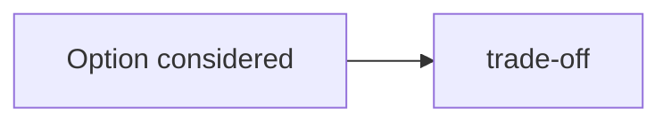

# ADR-NNNN · <title>

## Context
<what situation forced this decision. What you knew, what you didn't, why now. 2–4 sentences.>

## Diagram
<!-- Optional. Delete this section if no diagram adds value. Reach for one when the decision
     hinges on a flow, topology, or state machine that's clearer drawn than described.
     Markdown → Mermaid (per ADR-0005); see 91-Templates/DIAGRAM-CHEATSHEET.md. -->

## Decision
<the choice, stated as a present-tense imperative. Brief and unambiguous.>

> Example: "Use Postgres `jsonb` for the `order.metadata` column rather than a separate normalised table."

## Alternatives considered

<!-- If ≥3 viable approaches were compared, prefer building the sibling HTML first
     (91-Templates/EXPLORATION.template.html → 41-Reports/EXPLORATION-YYYY-MM-DD-<slug>.html),
     radio-select the winner, and paste its "Export → ADR options block" output below.
     Reference the artefact via the `exploration_html:` frontmatter field above, or with a
     markdown link in this section body — e.g.
     [side-by-side exploration](../41-Reports/EXPLORATION-YYYY-MM-DD-<slug>.html). -->

1. **<option>** — <why not chosen>
2. **<option>** — <why not chosen>
3. **<option>** — <why not chosen>

## Consequences

**Positive:**
- <bullet>
- <bullet>

**Negative / trade-offs:**
- <bullet>
- <bullet>

**Neutral:**
- <bullet — things that change but aren't a win or loss>

## Review trigger
<when to revisit this decision. A date, a metric threshold, an event. Examples:>

- _Revisit if query volume on `metadata` field exceeds 1k/sec_
- _Revisit after 6 months in production_
- _Revisit if we add a second tenant with different schema needs_

## Links
- **Originating story:** STORY-NN.M.PP
- **Related ADRs:** <or "—">
- **External references:** <docs, blog posts, RFCs>
