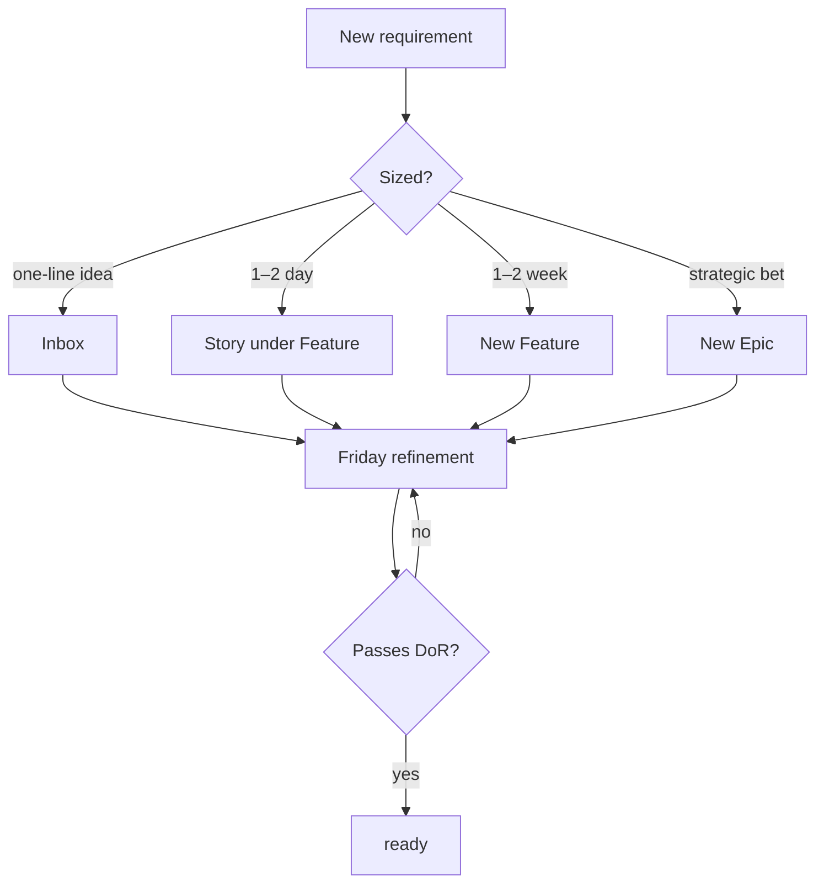
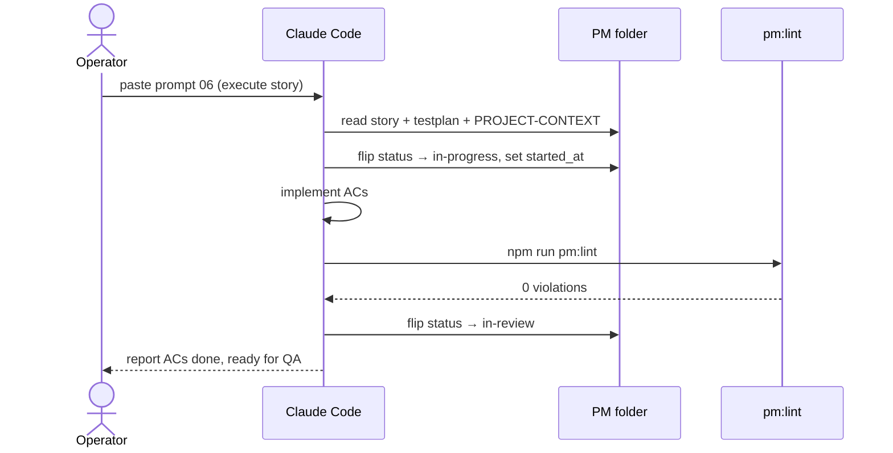
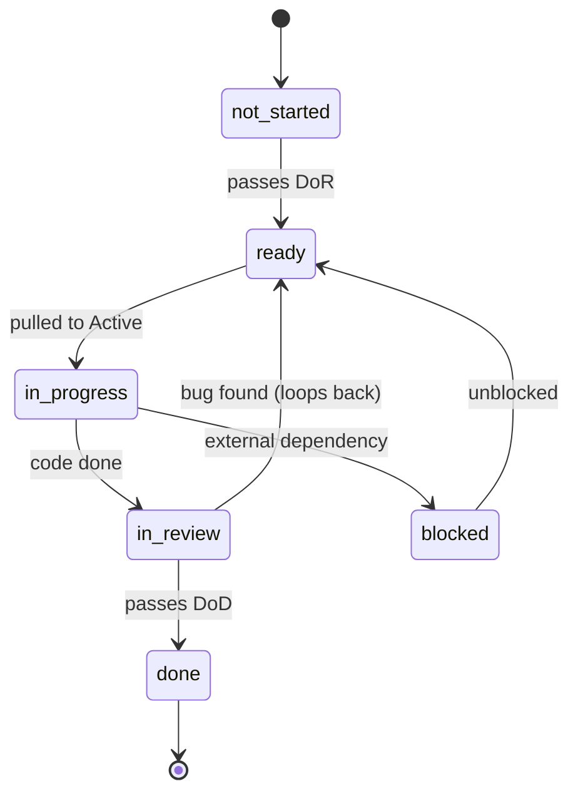
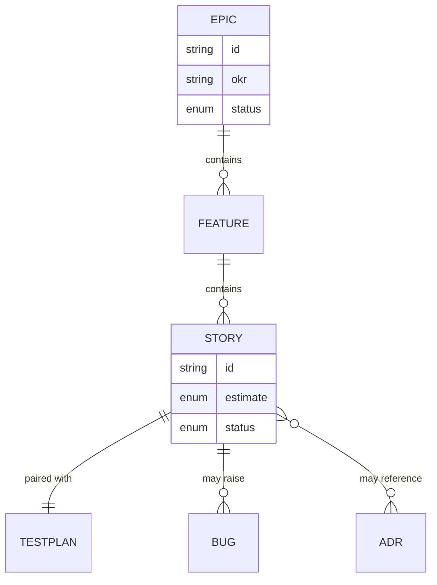

# Diagram Cheatsheet — Mermaid & SVG

Copy-paste worked examples for the kit's diagram convention. **The rule (ADR-0005):**

| Where the diagram lives | Use | Why |
|---|---|---|
| A markdown artefact (`.md`) — Epic, Feature, ADR, Standard, PRD | **Mermaid** fenced block | Renders natively on GitHub + VS Code preview; stays text-diffable; no external asset |
| An HTML artefact (`.html`) — exploration, report, dashboard | **Inline SVG** in the template's SVG slot | Reflows with the page, inherits light/dark theme tokens, keeps HTML artefacts CDN-free |

Reach for a diagram whenever a multi-step async flow, system topology, or state-machine transition would be clearer than prose. See SOP §11.1 and ADR-0005.

> **Version note:** all Mermaid below uses syntax that has rendered on GitHub and in VS Code since 2022 (`flowchart`, `sequenceDiagram`, `stateDiagram-v2`, `erDiagram`). If a viewer with an older Mermaid build fails to render `stateDiagram-v2`, fall back to the v1 `stateDiagram` keyword (same body syntax).

---

## 1. Flowchart — `flowchart`

Use for processes, decision trees, branching logic, "how does a request flow through the system".

````markdown

````

Renders as:


**Tips:** `TD` = top-down, `LR` = left-right. `[box]` = process, `{diamond}` = decision, `([stadium])` = start/end. Quote edge labels containing punctuation.

---

## 2. Sequence diagram — `sequenceDiagram`

Use for request/response ordering, async message flows, "who calls whom and in what order".

````markdown

````

Renders as:


**Tips:** `->>` = solid call, `-->>` = dashed return. `actor` draws a stick figure; `participant` draws a box. Declare participants up front to control left-right order.

---

## 3. State machine — `stateDiagram-v2`

Use for lifecycle / status enums and any "this thing moves between a closed set of states".

````markdown

````

Renders as:


**Tips:** `[*]` = start/end pseudo-state. State names can't contain hyphens — use underscores (`in_progress`) and a friendly `: label` if needed. Falls back to `stateDiagram` (v1) on older renderers.

---

## 4. ERD-light — `erDiagram`

Use for data-model sketches: entities, relationships, cardinality. "Light" = enough to communicate shape, not a full schema dump.

````markdown

````

Renders as:


**Cardinality crow's-foot legend:** `||` = exactly one, `o{` = zero-or-many, `|{` = one-or-many, `o|` = zero-or-one. Read left-to-right: `EPIC ||--o{ FEATURE` = "one Epic contains zero-or-many Features".

---

## 5. SVG in HTML artefacts

For HTML artefacts, don't use Mermaid — author inline SVG inside the template's named SVG slot so it inherits theme tokens and needs no runtime. The slot lives in [`HTML-ARTEFACT.template.html`](HTML-ARTEFACT.template.html), marked `data-slot="svg"` on the `.svg-wrap` container inside the Diagram panel. Copy the template, then replace the placeholder `<svg>` with your diagram. Use `var(--…)` CSS variables (e.g. `fill="var(--blue-soft)"`, `stroke="var(--blue)"`) so the diagram adapts to light/dark mode automatically.

```html
<div class="svg-wrap" data-slot="svg">
  <svg viewBox="0 0 600 220" xmlns="http://www.w3.org/2000/svg" role="img" aria-labelledby="diag-title">
    <title id="diag-title">Describe the diagram for screen readers</title>
    <!-- shapes using var(--blue), var(--teal), etc. so dark mode just works -->
  </svg>
</div>
```

**Tips:** always include a `<title>` for accessibility, give the `<svg>` a `viewBox` (not fixed width/height) so it scales, and colour with theme variables rather than hard-coded hex.

---

## Quick reference

| Need | Diagram type | Keyword |
|---|---|---|
| Process / branching / decisions | Flowchart | `flowchart TD` / `flowchart LR` |
| Ordered message exchange | Sequence | `sequenceDiagram` |
| Lifecycle / status enum | State machine | `stateDiagram-v2` |
| Data model shape | ERD-light | `erDiagram` |
| Diagram inside an HTML artefact | Inline SVG | `<svg>` in the `data-slot="svg"` region |
