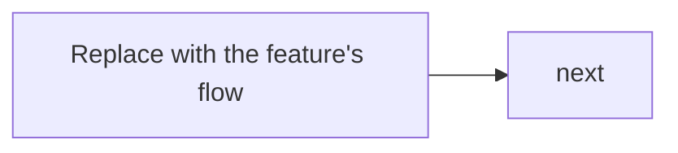

# FEAT-NN.M · <title>

## Goal
<one paragraph. The slice of the epic this delivers.>

## User value
<the operator/customer experience that improves. One sentence.>

## Diagram
<!-- Optional. Delete this section if no diagram adds value. Reach for one when a flow,
     interaction, or state transition would be clearer than prose. Markdown → Mermaid
     (per ADR-0005); see 91-Templates/DIAGRAM-CHEATSHEET.md for worked examples. -->

## Scope
- <bullet — what this feature includes>
- <bullet>

## Acceptance criteria
- [ ] <testable AC — what must be true when the feature is shipped>
- [ ] <testable AC>
- [ ] <testable AC>

## Stories
- [STORY-NN.M.PP — <title>](../../32-Stories/EPIC-NN/FEAT-NN.M/STORY-NN.M.PP-<slug>.md)

## Dependencies
- <other features / stories / infra>

## Data touched
- **Reads:** <…>
- **Writes:** <…>
- **New schema / migration:** <or "none">

## Risks
- <bullet>

## Decisions
<list ADRs created during this feature's execution>
<!-- - [ADR-NNNN — <title>](../../40-Decisions/ADR-NNNN-<slug>.md) -->
