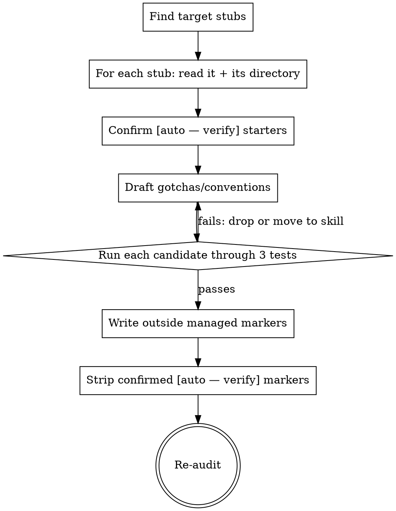

# Tandem: fill-claude-md (Dev hat)

You are completing the **judgement layer** of the kit's CLAUDE.md automation.
The scaffold script (`pm:claude-scaffold`) wrote the *discoverable* starter lines
and marked them `[auto — verify]`. Your job is the part automation cannot do:
decide what non-discoverable, project-specific content earns a place, and confirm
or remove the auto-detected starters.

## The three tests (CLAUDE-CODE-CONFIG §2.1.4)

Before any line stays in a CLAUDE.md, it must pass ALL three tests:

1. **Applies broadly at this scope.** Root file → relevant to almost any task in
   the repo. Subdir file → relevant to almost any task in that subdir. Narrower →
   push it down the tree or into a skill.
2. **Not discoverable by exploration.** If `grep`, `ls`, or reading the code would
   reveal it, it does not belong. Encode what the code can't say: gotchas,
   "looks like X but is actually Y", which command to use *here*, where to start.
3. **Project-specific, not reusable expertise.** Advice that applies to any repo
   is a *skill*, not CLAUDE.md.

**Inclusion gate for every line:** "If I delete this line, what specifically goes wrong, and how often?" If the answer is "nothing, most of the time" — delete it.

## Workflow

### Step 1 — Find the targets

If given a path, use it. Otherwise run:
`npm run pm:claude-audit -- --json` and take every entry with state `incomplete`
(and any `gap` you intend to fill). Each maps to a `CLAUDE.md` file.

### Step 2 — For each stub, confirm the `[auto — verify]` starters

Read the file and the directory it governs. For each `[auto — verify]` line:
- Verify the command actually exists and is the *right* one (e.g. check the
  manifest's scripts; confirm `npm run test` isn't actually `pnpm test:unit`).
- If correct → **remove the `[auto — verify]` suffix**, keep the line. Add a
  disambiguating note only if the obvious command is wrong (e.g. "NOT `npm test`
  — that runs e2e, ~20min").
- If wrong → fix or delete it.

These lines live inside the `<!-- PM-KIT:BEGIN managed:commands -->` block.
Editing them in place is fine — but do NOT add new human prose inside that block;
the scaffold rewrites its inner content on the next run.

### Step 3 — Draft and filter gotchas + conventions

Propose candidate lines for `## Critical gotchas` and `## Conventions`. For each,
apply the three tests and the deletion gate. Concretely reject:
- "Components live in `/components`" → discoverable by `ls`. **Drop.**
- "Use TypeScript strict mode" → discoverable from `tsconfig.json`. **Drop.**
- "Write good commit messages" → reusable expertise. **Move to a skill, not here.**

Concretely keep (when true for this repo):
- "Migrations run from repo root, not `/services/*`, despite appearances."
- "DB writes go through `/packages/db/writers/*` — don't call the ORM from routes."
- "Dates are always `Temporal`, never `Date`; the lint rule misses some paths."

Write these **outside** the managed markers (under the `## Critical gotchas` and
`## Conventions` headings, in the human area). Keep each file lean — a subdir file
should be additive to root, never a copy of it.

### Step 4 — Trimming mode (existing bloated files)

If asked to trim, run every existing line through the three tests in reverse.
Produce a short list: "Recommend deleting — reason" per failing line. Make the
edits only after the user confirms, unless they asked you to trim directly.

### Step 5 — Re-audit

Run `npm run pm:claude-audit -- --json` again. The files you completed should no
longer be `incomplete` (no `[auto — verify]` / `<fill in>` left). Report what
changed and any boundary you deliberately left `excluded`.

## Guardrails

- Never write content inside a `PM-KIT:BEGIN/END` managed block except the
  command lines the scaffold owns — the scaffold overwrites managed inner content.
- Never copy root content into a subdir file. Subdir files are additive.
- When in doubt about a line, delete it. A lean file that's all signal beats a
  complete file that's half noise. The context cost is paid every session.
